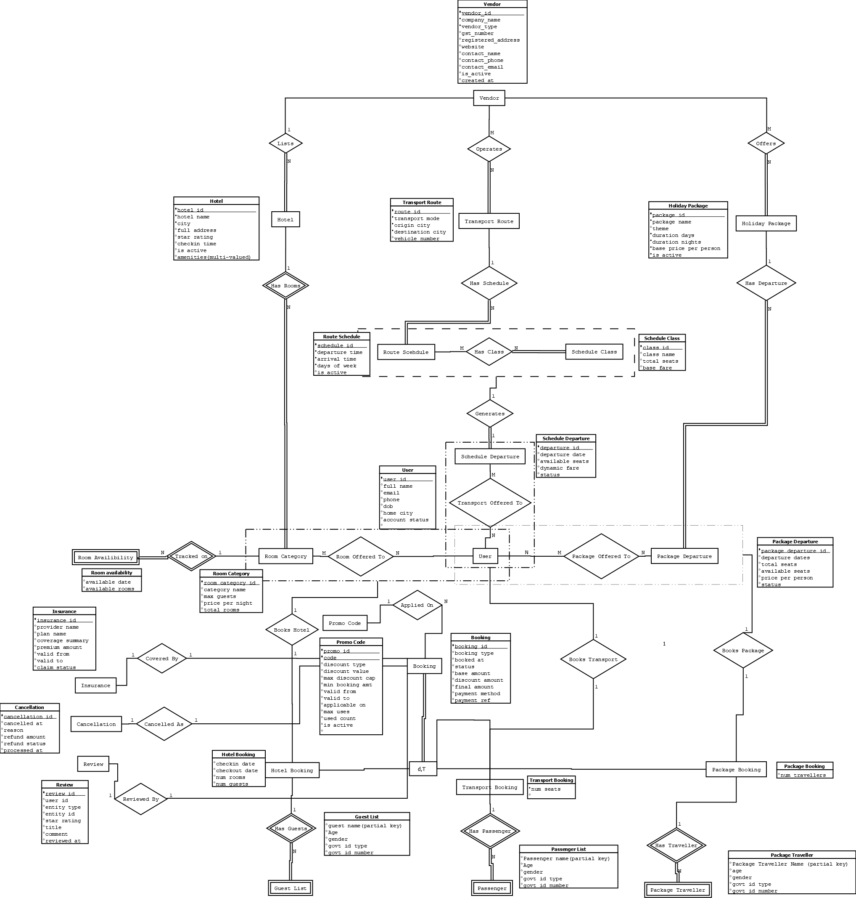
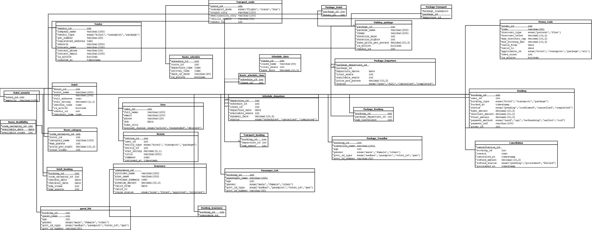
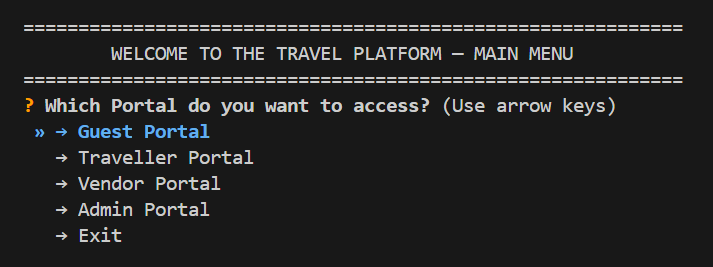
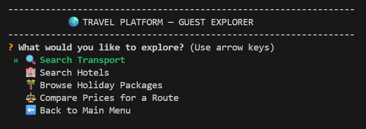
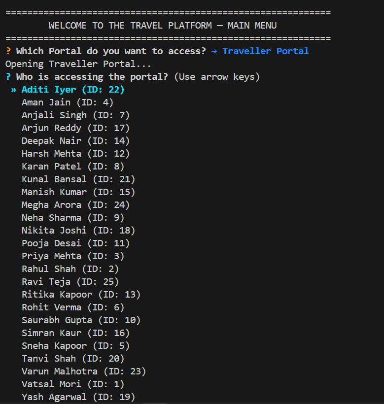
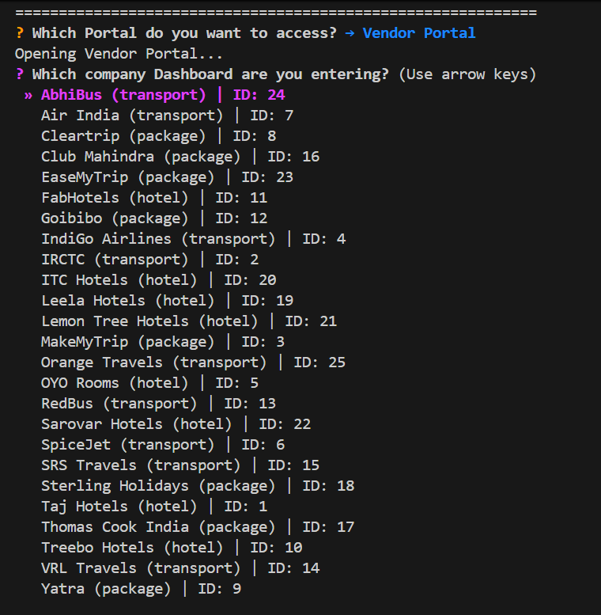
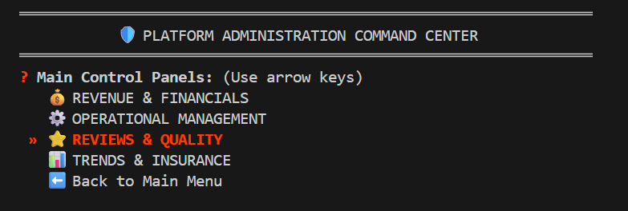

#  Multi-Vendor Travel Booking System

Welcome to the **Trip and Travel Booking System**, a robust, enterprise-grade application crafted to unify a highly fragmented travel industry. 


## 1. Project Explanation & Problem Statement

###  The Problem
Currently, the travel ecosystem is deeply fragmented. Travellers must juggle multiple platforms to book a flight, secure a hotel, arrange holiday packages, and manage their trip insurance. On the other side, vendors (airlines, hotel chains, and tour operators) lack unified analytics to see how they perform in the broader marketplace. Furthermore, platform administrators have zero visibility into cross-sector revenue and platform-wide service quality.

###  Our Solution: 4 Portals
We designed a comprehensive, command-line interface (CLI) that solves this fragmentation by uniting all stakeholders under a single architecture. 

To serve the distinct needs of every user role, we divided the ecosystem into **4 Specialized Portals**:
1. **Guest Portal:** Allows unauthenticated users to explore the universe of flights, trains, hotels, and holiday packages, equipped with advanced filtering and price-comparison tools.
2. **Traveller Portal:** A secure dashboard where registered users can manage their complete booking histories, track upcoming itineraries, monitor refunds, and analyze their personal travel spending.
3. **Vendor Portal:** A corporate CRM for travel providers (like IndiGo, Marriott, or IRCTC). They can track live sales, manage upcoming customer logistics and respond to poor reviews.
4. **Admin Portal:** The supreme command center. Platform owners use this to oversee global revenue, process pending cancellation refunds across all vendors, track macro-level booking trends, and identify the highest and lowest-rated vendors on the platform.

---

## 2. Database Schema Architecture

The backbone of this platform is a highly normalized relational database handling bookings (Transport, Hotel, Packages), review systems, insurance linking, and complex scheduling.

<details>
  <summary><b>Click here to unfold Entity-Relationship (ER) Schema</b></summary>
  
  <br>

  

</details>

<details>
  <summary><b>Click here to unfold the Relational Database Schema</b></summary>
  
  <br>

  

</details>

---

## 3. Top 3 Logical & Practical Queries

To demonstrate the analytical power of our platform, here are three of the most advanced and practically applied SQL queries driving our application.

### Query 1: Advanced Hotel Search Engine
**Problem Statement:** A guest wants to find luxury hotels in "Delhi" for "2026-05-01" that have at least a 4.0 star rating, fit within a budget of ₹5,000 to ₹15,000 per night, and has available rooms.

**SQL Solution:**
```sql
SELECT
    h.hotel_name,
    h.city,
    h.full_address,
    h.star_rating,
    v.company_name AS vendor,
    rc.category_name,
    rc.price_per_night,
    ra.available_rooms
FROM Hotel h
JOIN Vendor v ON v.vendor_id = h.vendor_id
JOIN Room_Category rc ON rc.hotel_id = h.hotel_id
JOIN Room_Availability ra ON ra.room_category_id = rc.room_category_id
WHERE h.city = 'Delhi' 
  AND ra.available_date = '2026-05-01'
  AND ra.available_rooms > 0
  AND h.star_rating >= 4.0
  AND rc.price_per_night BETWEEN 5000 AND 15000
ORDER BY h.star_rating DESC, rc.price_per_night ASC;
```
**Explanation:** This query links four tables. It filters out sold-out dates instantly by checking the `Room_Availability`. It then applies the budget and quality filters, prioritizing the highest-rated hotels with the most competitive pricing.

**Required Console Input Data:**

| Test Case | City Input | Date Input | Min Star Rating | Price Range |
| :--- | :--- | :--- | :--- | :--- |
| **Test 1** | `Delhi` | `2026-05-01` | `5.0 Stars` | `₹8,000–₹15,000/night` |
| **Test 2** | `Mumbai` | `2026-05-01` | `3.0 Stars` | `Any` |
| **Test 3** | `Bangalore` | `2026-05-02` | `3.0 Stars` | `Under ₹3,000/night` |

---

###  Query 2: Traveller Spending Summary
**Problem Statement:** A registered traveller wants to know exactly how much they have spent across all service types (Flights, Hotels, Packages) in their lifetime, strictly excluding any bookings that were cancelled.

**SQL Solution:**
```sql
SELECT
    b.booking_type AS service_type,
    COUNT(*) AS booking_count,
    SUM(b.final_amount) AS total_spent,
    SUM(b.discount_amount) AS total_discount_saved
FROM Booking b
WHERE b.user_id = 1
  AND b.status <> 'cancelled'
GROUP BY b.booking_type
ORDER BY total_spent DESC;
```
**Explanation:** Instead of writing three separate queries for hotels, flights, and packages, we rely on our polymorphic `Booking` super-table. We group the aggregated financial sums (`SUM`) by `booking_type`, strictly filtering out canceled records (`status <> 'cancelled'`).

**Required Console Input Data:**

| Test Case | User Selection Input | Period Input |
| :--- | :--- | :--- |
| **Test 1** | `Pooja Desai (ID: 11)` | `All Time` |
| **Test 2** | `Priya Mehta (ID: 3)` | `All Time` |
| **Test 3** | `Aman Jain (ID: 4)` | `All Time` |

---

###  Query 3: Polymorphic Vendor Revenue Aggregation
**Problem Statement:** Vendors offer fundamentally different products (Seats vs Rooms vs Tour Packages). An executive at the vendor company needs a single, unified daily revenue report detailing exactly how much money they made across every service they own.

**SQL Solution:**
```sql
SELECT
    DATE(b.booked_at) AS booking_date,
    b.booking_type,
    COUNT(*) AS bookings,
    SUM(b.final_amount) AS revenue
FROM Booking b
JOIN (
    SELECT hb.booking_id FROM Hotel_Booking hb
    JOIN Room_Category rc ON rc.room_category_id = hb.room_category_id
    JOIN Hotel h ON h.hotel_id = rc.hotel_id
    WHERE h.vendor_id = 1
    UNION ALL
    SELECT tb.booking_id FROM Transport_Booking tb
    JOIN Schedule_Departure sd ON sd.departure_id = tb.departure_id
    JOIN Route_Schedule rs ON rs.schedule_id = sd.schedule_id
    JOIN Transport_Route tr ON tr.route_id = rs.route_id
    WHERE tr.vendor_id = 1
    UNION ALL
    SELECT pb.booking_id FROM Package_Booking pb
    JOIN Package_Departure pd ON pd.package_departure_id = pb.package_departure_id
    JOIN Holiday_Package hp ON hp.package_id = pd.package_id
    WHERE hp.vendor_id = 1
) vendor_bookings ON vendor_bookings.booking_id = b.booking_id
WHERE b.status <> 'cancelled'
GROUP BY DATE(b.booked_at), b.booking_type
ORDER BY booking_date DESC, b.booking_type;
```
**Explanation:** This is a master-class in SQL `UNION ALL` statements. Because a vendor like "Taj Hotels" might eventually offer Transport or Packages, we dynamically build a subquery ledger of *every booking ID* tied to their specific `vendor_id`. We then join this dynamic ledger onto the main `Booking` financial table and group by date.

**Required Console Input Data:**

| Test Case | Vendor Selection Input | Time Period Input | Breakdown Input |
| :--- | :--- | :--- | :--- |
| **Test 1** | `MakeMyTrip (ID: 3)` | `Monthly` | `By Service Type` |
| **Test 2** | `OYO Rooms (ID: 5)` | `Annual` | `Overall` |
| **Test 3** | `Lemon Tree Hotels (ID: 21)` | `Monthly` | `Overall` |

---

## 4. Minimal Functional Dependencies (FDs) & BCNF Proof

Our database was meticulously designed to eliminate data redundancy and prevent insert/update/delete anomalies. We achieved this by ensuring every single relation is rigidly in **Boyce-Codd Normal Form (BCNF)**. 

### The Proof
To prove our tables are in BCNF, we proved that for every Minimal FD rule in our system, the left side of the arrow (the determinant) is **always** the primary Candidate Key.

**Example 1: The "User" Table**
*   **Minimal FD Rule:** `user_id  →  full_name, email, phone, dob, home_city, account_status`
*   **Proof:** If I know the `user_id`, I know everything about the user. Because `user_id` dictates everything, it is the *Candidate Key*. Since the left side of our arrow is the Candidate Key, the User table is perfectly in BCNF.

**Example 2: The "Schedule_Departure" Table**
*   **Minimal FD Rule:** `departure_id  →  schedule_id, class_id, departure_date, available_seats, dynamic_fare, status`
*   **Proof:** A specific departure on a specific date is entirely identified by `departure_id`. So, `departure_id` is the Candidate Key (Superkey), meaning this layout is completely free of repeating redundancy.

**Example 3: Weak Entities (Guest_List)**
*   **Minimal FD Rule:** `booking_id, guest_name  →  age, gender, govt_id_type, govt_id_number`
*   **Proof:** Two people might be named "John", but within a single `booking_id`, the name "John" identifies a specific traveler. Thus, the composite key `{booking_id, guest_name}` is the Superkey. The table is purely BCNF.

Every junction table (like `Route_Schedule_Class` or `Booking_Insurance`) consists *only* of Foreign Keys. Because they have no non-trivial dependencies, they satisfy BCNF automatically.

---

##5. Console Portals & Output Showcases

The application runs exclusively in the terminal using incredibly premium, interactive, color-coded menus driven by Python.

### 1. Global Entry Point

**Purpose:** The central gateway. Routes the physical user to the portal assigned to their role.

### 2. The Guest Portal

**Purpose:** An unauthenticated explorer's paradise. Let's users search without commitment.
**Problems Solved Here:**
*   Searching transport mechanisms across airlines, railways, and buses instantly.
*   Cross-referencing prices of different transport vendors for the same exact route side-by-side.
*   Filtering hotels by budget tiers and real-time room availability.

### 3. The Traveller Portal

**Purpose:** A highly secure account manager for confirmed travelers.
**Problems Solved Here:**
*   Consolidating separate flight, hotel, and package receipts into one "My Bookings" timeline.
*   Tracking live Insurance Claim status (Filed, Approved, Rejected).
*   Visualizing total financial spend vs savings obtained via promo codes.

### 4. The Vendor Corporate Dashboard

**Purpose:** The ultimate CRM and business intelligence tool for travel operators.
**Problems Solved Here:**
*   Generating Sales Registers and Revenue Ledgers dynamically.
*   Tracking pending operational bookings so vendors can prepare customer logistics using embedded Contact Phone numbers.

### 5. The Platform Administration Center

**Purpose:** The Global view for platform executives.
**Problems Solved Here:**
*   Auditing macro-level platform Revenue and slicing it up by City, Vendor, or Sub-Service.
*   Identifying "Poor Services" algorithmically (Services with an average customer rating < 2.5) to maintain platform quality control.
*   Authorizing and monitoring pending Cancellation Refunds to maintain global ledger integrity.

---

##  6. System Execution Architecture (The Flow)

How does a terminal click turn into a complex data response? Here is our decoupled operational flow:

| Step | Architecture Layer | Action Occurring |
| :--- | :--- | :--- |
| **1. Input** | `main.py` | User launches app and selects a Portal (e.g., Vendor). |
| **2. UI Routing** | `menus/vendor_menu.py` | The Interactive UI displays rounded menus and collects refined inputs (e.g., "Revenue", "Monthly", "IRCTC"). |
| **3. Query Request** | `query_engine/vendor_queries.py` | UI passes variables to the Intelligence Engine. Dynamic SQL is written using parameterized inputs to prevent SQL Injection. |
| **4. Database Auth** | `connection.py` | The Engine securely requests a PostgreSQL session using hidden `.env` configurations. |
| **5. Data Execution** | `PostgreSQL Database` | The multi-join query runs instantly over the BCNF-optimized schema. |
| **6. Output Render** | `query_engine.py` + `tabulate` | Raw list data is converted into a beautiful grid table, clears the screen, and presents the intelligence to the screen! |

---

##  7. Developer Execution Guide
**1. Database Setup:**
Ensure PostgreSQL is running. Open `pgAdmin` or `psql` and run the files in this order:
1.  `ddl_script.sql` (Builds the tables)
2.  `sample_data_insert.sql` (Populates the entire universe)

**2. Virtual Environment:**
```bash
# Navigate to the project root
python -m venv .venv

# Activate the venv (Windows)
.venv\Scripts\activate

# Install visual dependencies
pip install -r backend/requirements.txt
```

**3. Environment Variables:**
Rename `.env.example` to `.env` and fill in your local Postgres credentials:
```env
DB_USER=postgres
DB_PASS=your_password
DB_NAME=travel_platform
DB_HOST=localhost
DB_PORT=5432
```

**4. Launch The Platform:**
```bash
python backend/main.py
```
*Enjoy your unified travel experience!*
